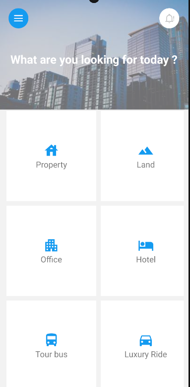
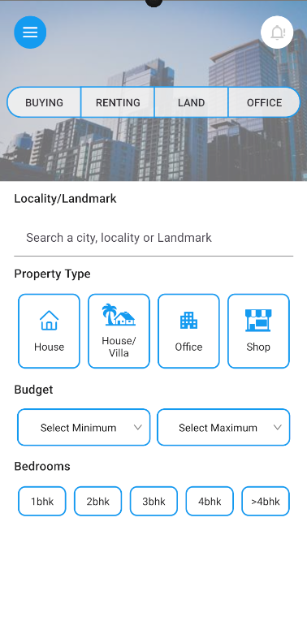

### Installation guide
```bash
# use npm
npm install 

npm react-native run-android
```

Run both of these commands after starting your android emulator

## Screenshots added below
<div style="display: flex; justify-content: space-between;">
  
  
</div>


https://github.com/hd-official-github/interviewApp/assets/91799426/8d40c683-c42f-42bb-bc36-f6a9bccf5dc8

